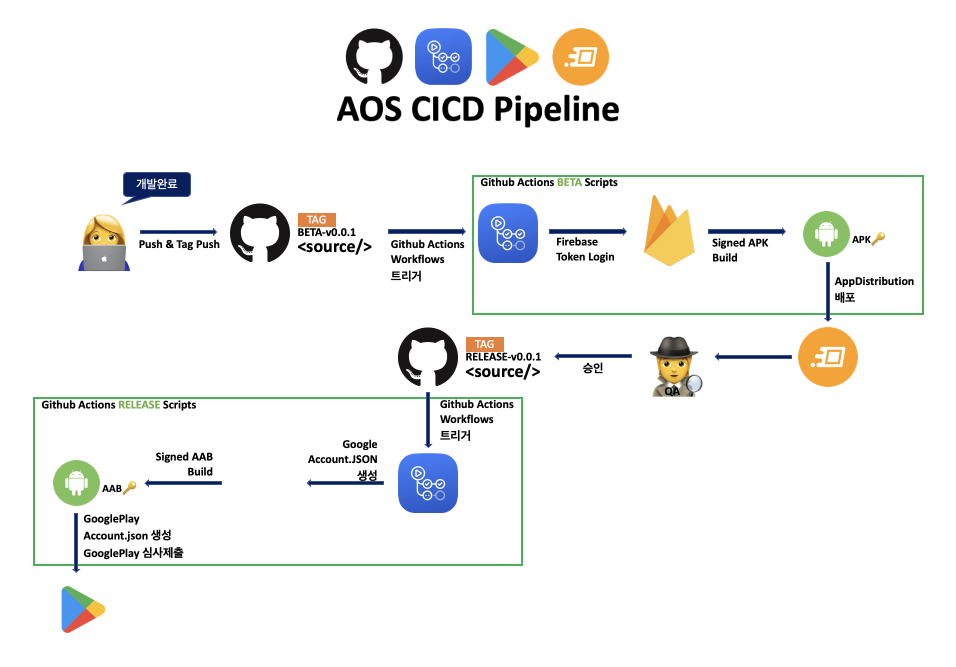

<h1 align="left">CICD-AOS</h1>

<p align="left">
  <a href="https://opensource.org/licenses/Apache-2.0"></a>
  <a href="https://android-arsenal.com/api?level=32"></a>
  <a href="https://jroomstudio.tistory.com/"></a>
  <a href="https://github.com/jhk-im"></a> 
</p>

</br>

<p align="letft">  

</p>

## Github Actions BETA Scripts
```bash
# Github Actions
name: BETA - Deployment to Firebase App Distribution
on:
  push:
    tags:
      - BETA*

# Build AAB
jobs:
  build:
    runs-on: ubuntu-latest

    steps:
      - name: Checkout
        uses: actions/checkout@v3

      - name: Set up JDK 11
        uses: actions/setup-java@v3.3.0
        with:
          distribution: 'zulu'
          java-version: '11'

      - name: Grant execute permission for gradlew
        run: chmod +x gradlew

      - name: Add local properties
        run: echo '${{ secrets.LOCAL_PROPERTIES }}' > ./local.properties

      - name: Add google services
        run: echo '${{ secrets.GOOGLE_SERVICES_JSON }}' > ./app/google-services.json

      - name: Build with gradle
        run: ./gradlew build

      - name: Build aab
        id: buildAAB
        run: ./gradlew bundleRelease

      - name: Sign aab
        id: signAAB
        uses: r0adkll/sign-android-release@v1
        with:
          releaseDirectory: app/build/outputs/bundle/release
          signingKeyBase64: ${{ secrets.SIGNING_KEY }}
          alias: ${{ secrets.ALIAS }}
          keyStorePassword: ${{ secrets.KEY_STORE_PASSWORD }}
          keyPassword: ${{ secrets.KEY_PASSWORD }}

# Upload App Distribution  
      - name: Upload aab to Firebase App Distribution
        uses: wzieba/Firebase-Distribution-Github-Action@v1
        with:
          appId: ${{ secrets.FIREBASE_APP_ID }}
          serviceCredentialsFileContent: ${{ secrets.CREDENTIAL_FILE_CONTENT }}
          groups: testers
          file: app/build/outputs/bundle/release/app-release.aab
```